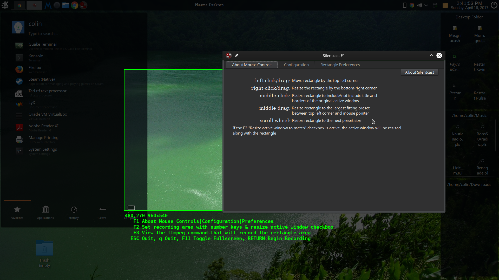

Silentcast
==========

This is not a full README (yet) for v3.0 which has a completely different GUI than previous versions. 
It's more intuitive than previous versions and explains itself well enough.
*It does not support running multiple copies of itself*, however, and so cannot record itself the way that 
the previous version did: bad things will happen if you try to run Silentcast v3.0 while it is already running.
If you make the mistake of trying to run Silentcast v3.0 while it is already running, make sure you run

    pkill -f ffmpeg

when it closes (crashes) so that `silentcast/temp.mkv.` doesn't take over your hard drive. Due to a bug that
shows on some systems where silencast is unable to kill the ffmpeg process it spawned directly, v3.01 is currently
also killing all instances of ffmpeg so that it's not possible to get a full recording of silentcast in action 
using ffmpeg either.
This problem will be fixed in future releases, but other bugs will probably be fixed first because not many 
people need to record Silentcast in action.

When ran, you will instantly get a green rectangle surrounding the active window. If that's what you wanted to
record, just press Return to start and then click the minimized Silentcast icon to stop. Here is a screenshot
showing the F1 dialog and green rectangle. This one picture explains most of what you need to know to use Silentcast v3.0:



#### Dependencies
- gtk3
- ffmpeg
- imagemagick

#### Manual Installation
- Install the dependencies, [Download Latest Release of Silentcast from github.com](https://github.com/colinkeenan/silentcast/releases/latest), and extract. If extracted in your Downloads directory, this is how you would complete the installation:

```
$ cd ~/Downloads/silentcast-3.0
$ make
$ sudo ./install
```

You should then find silentcast in your launcher. You can uninstall it with `sudo ./uninstall` in the same directory.

You can also test what these scripts do passing a destination directory (that doesn't need to exist already).
For example, install to `test`, use `tree` to see what it did, and then uninstall from `test`. (You will probably need to install `tree`.)

```
$ ./install test
$ tree test
test
├── etc
│   ├── silentcast.conf
│   └── silentcast_presets
└── usr
    ├── bin
    │   └── silentcast
    └── share
        ├── applications
        │   └── silentcast.desktop
        ├── doc
        │   └── silentcast
        │       └── README.md
        ├── icons
        │   └── hicolor
        │       ├── 128x128
        │       │   └── apps
        │       │       └── silentcast.png
        │       ├── 24x24
        │       │   └── apps
        │       │       └── silentcast.png
        │       ├── 256x256
        │       │   └── apps
        │       │       └── silentcast.png
        │       ├── 32x32
        │       │   └── apps
        │       │       └── silentcast.png
        │       ├── 48x48
        │       │   └── apps
        │       │       └── silentcast.png
        │       └── 64x64
        │           └── apps
        │               └── silentcast.png
        └── licenses
            └── COPYING

22 directories, 12 files
$./uinstall test
$tree test
test
├── etc
└── usr
    ├── bin
    └── share
        ├── applications
        ├── doc
        ├── icons
        │   └── hicolor
        │       ├── 128x128
        │       │   └── apps
        │       ├── 24x24
        │       │   └── apps
        │       ├── 256x256
        │       │   └── apps
        │       ├── 32x32
        │       │   └── apps
        │       ├── 48x48
        │       │   └── apps
        │       └── 64x64
        │           └── apps
        └── licenses

21 directories, 0 files
```

Notice that `./uninstall test` deleted all the files, but only deleted the one subdirectory named `silentcast`. Don't forget to specify `test` when uninstalling, and don't use `sudo` when not doing a system-wide install or uninstall.
