Silentcast
==========

<!--
BETTER TO VIEW THIS IN A MARKDOWN VIEWER
When viewed in a markdown viewer, you'll get pictures and even animations made with silentcast. If you don't have a markdown viewer, I personally use a Google Chrome Extension:

https://chrome.google.com/webstore/detail/markdown-preview/jmchmkecamhbiokiopfpnfgbidieafmd

After installing the Markdown Preview extenstion, you can't use it until you go into

chrome://extensions/

to checkmark the box under

Markdown Preview
 for *Allow access to file URLs*

Then, just open this file with Chrome. You'll probably want to make Google Chrome the default for .md files. You can also just drag and drop this file to an empty tab in Chrome.
-->

##Demos

Notice there's a stop icon  in the Notificaton Area before I even start Silentcast, then a 2nd stop icon  appears when recording begins. That's because I already had Silentcast running to make these animated gifs of how to use Silentcast. Silentcast 1 keeps going after I stop Silentcast 2.

###Fullscreen: How to use Silentcast to record Gimp

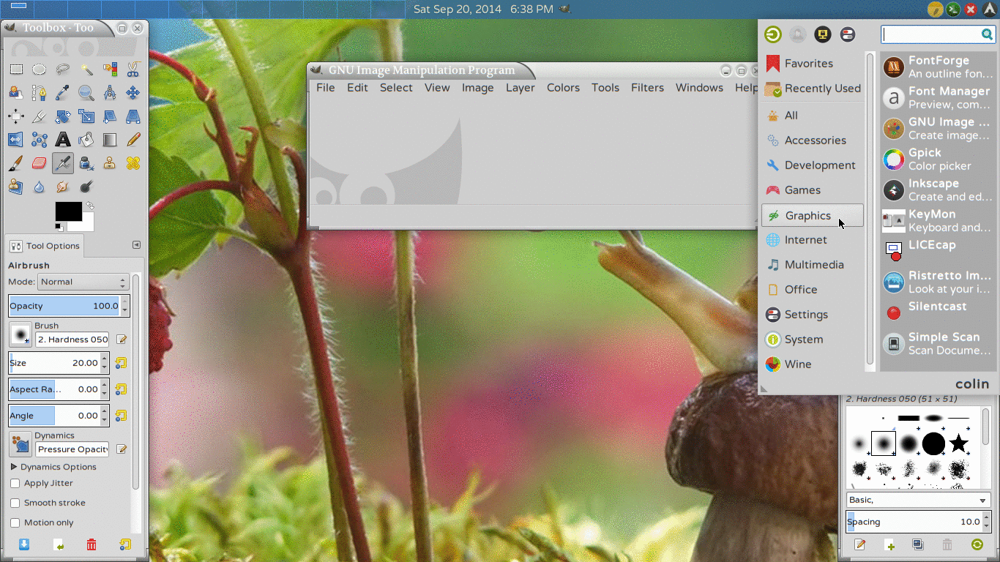

###Transparent: How to use Silentcast to record 2 windows

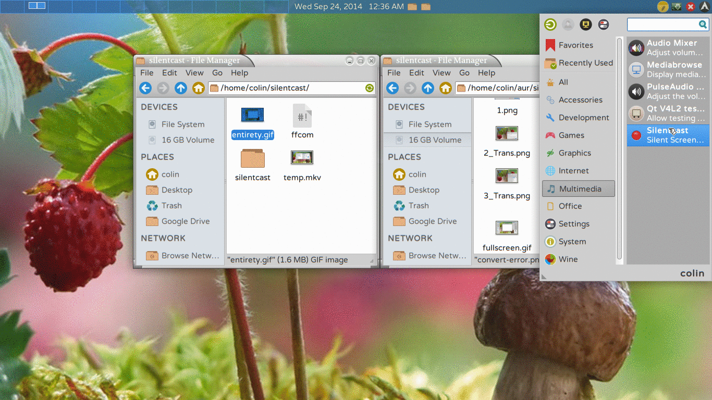

###Interior: How to use Silentcast to only record the drawing

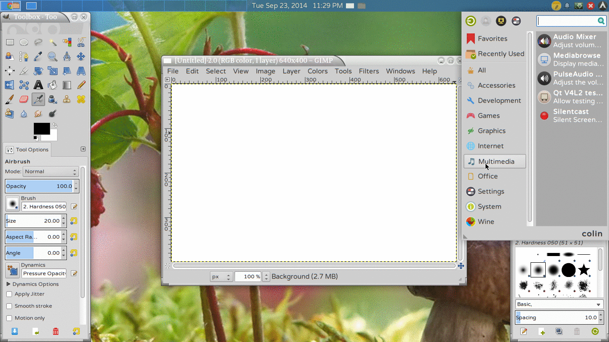

###Entirety: How to use Silentcast to record 1 window

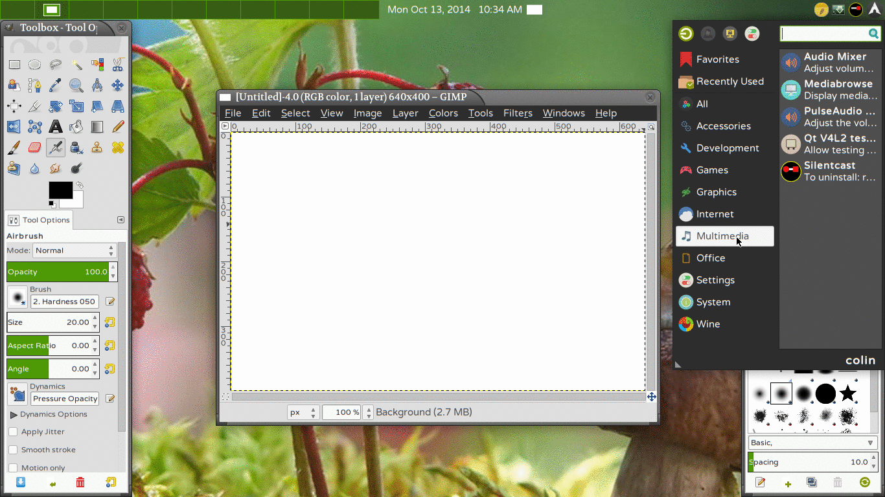

##Guides

###Getting Silentcast

<table>
  <thead>
    <tr>
      <th colspan="2">Dependencies (Arch package names used)</th>
    <tr>
    <tr>
      <th>package</th>
      <th>reason</th>
    </tr>
  </thead>
  <tr>
    <td>bash</td>
    <td>because Silentcast is mostly bash scripts and I use bashisms</td>
  </tr>
  <tr>
    <td>ffmpeg</td>
    <td>for recording and extracting images</td>
  </tr>
  <tr>
    <td>imagemagick</td>
    <td>for 'convert' to animate images</td>
  </tr>
  <tr>
    <td>yad</td>
    <td>for the GUI - popup dialogue windows</td>
  </tr>
  <tr>
    <td>xdotool</td>
    <td>for getting the active window id</td>
  </tr>
  <tr>
    <td>xorg-xrandr</td>
    <td>for getting screen size</td>
  </tr>
  <tr>
    <td>xorg-xwininfo</td>
    <td>for getting window size and position</td>
  </tr>
  <tr>
    <td>wmctrl</td>
    <td>for resizing and positioning windows</td>
  </tr>
  <tr>
    <td>python-gobject</td>
    <td>for 'gi.repository' which has Gtk</td>
  </tr>
  <tr>
    <td>python-cairo</td>
    <td>for making Gtk+ window transparent</td>
  </tr>
  <tr>
    <td>xdg-utils</td>
    <td>for 'xdg-open' to open the file-browser</td>
  </tr>
</table>

- **Desktop Environment Requirements**
    - A desktop that includes a standard system-tray notification area with clickable icons. Works with most popular desktops, including Unity, but I haven't been able to figure out how to get yad notification to show up in Gnome yet.
    - [A compositing window manager](http://en.wikipedia.org/wiki/Compositing_window_manager#List_of_compositing_window_managers) that is compatible with the [EWMH/NetWM](http://en.wikipedia.org/wiki/Extended_Window_Manager_Hints) specification.

- **Installing Dependencies by Distro**
    - Arch
        - Install what you can with pacman

                $ sudo pacman -S bash ffmpeg imagemagick xdotool xorg-xrandr xorg-xwininfo wmctrl python-gobject python-cairo xdg-utils

        - Install yad from the AUR with your AUR helper or [Download yad.tar.gz from aur.archlinux.org](https://aur.archlinux.org/packages/ya/yad/yad.tar.gz), extract, and do `makepkg -si` from the extracted directory

    - Ubuntu
        - Install what you can with apt-get

                $ sudo apt-get install bash libav-tools imagemagick x11-xserver-utils xdotool wininfo wmctrl python-gobject python-cairo xdg-utils
                $ sudo ln -s /usr/bin/avconv /usr/bin/ffmpeg
        - Look for **Download "yad"** at [yad](http://www.ubuntuupdates.org/package/webupd8/trusty/main/base/yad),
       click the 32 bit or 64 bit version and let Software Center install it.

    - Fedora
        - Make sure you have the multimedia repository, [rpmfusion](http://rpmfusion.org/Configuration)

                $ su -c 'yum localinstall --nogpgcheck http://download1.rpmfusion.org/free/fedora/rpmfusion-free-release-$(rpm -E %fedora).noarch.rpm http://download1.rpmfusion.org/nonfree/fedora/rpmfusion-nonfree-release-$(rpm -E %fedora).noarch.rpm'

        - Now install everything with yum

                $ sudo yum install bash ffmpeg ImageMagick xdotool wmctrl xdg-utils yad

- **Try it *before* you install it!** (If you already installed it, uninstall before trying this.)
    - Install the dependencies as listed above, [Download Latest Release of Silentcast from github.com](https://github.com/colinkeenan/silentcast/releases/latest), and extract.

    - In Xfce, you can just double click **bash silentcast** in the extracted folder. Seems as though most other desktops don't default to running in the same directory as the launcher, so you'l have to run it in the terminal.
    - Here's an example of running it from the terminal:

            $ cd ~/Downloads/silentcast-1.7
            $ bash silentcast

    - That's it! Nothing will be installed to your system folders, and you can get rid of Silentcast just by deleting the download and extracted folder.
    - If you want to make the **bash silentcast** launcher work instead of doing a full install, edit `bash_silentcast.desktop` in a terminal and put the full path in, for example `Exec=/home/colin/Downloads/silentcast-1.7/silentcast` and `Path=/home/colin/Downloads/silentcast-1.7/`
    - Note that **if you have done a full install of Silentcast**, you will end up running portions of that installation when running *bash silentcast*. So, to try out this method, first **uninstall the full installation of Silentcast**.

- **Arch Linux Full Install**
    - Use an AUR helper, like `yaourt -S silentcast`. This will automatically install the latest release and missing dependencies. Keep your install up to date the usual way with your AUR helper, like `yaourt -Syua`. **Uninstall** with `sudo pacman -R silentcast`
    - Without an AUR helper, just [Download silentcast.tar.gz from aur.archlinux.org](https://aur.archlinux.org/packages/si/silentcast/silentcast.tar.gz), extract, and do `makepkg -si` from the extracted directory. This will do exactly the same thing as an AUR helper would do for installation, but you will have to keep track of updates yourself. **Uninstall** with `sudo pacman -R silentcast`

- **Any Linux Distro Full Install**
    - Install missing dependencies (see the *Dependencies* table and *Installing Dependencies by Distro* above)
    - Download a version of Silentcast:
        - Should always work as intended: [Download Latest Release of Silentcast from github.com](https://github.com/colinkeenan/silentcast/releases/latest)
        - Most likely working right: [Download Silentcast master.zip from github.com](https://github.com/colinkeenan/silentcast/archive/master.zip)
        - Probably broken when in active development, otherwise the same as master: [Downlad Silentcast next.zip from github.com](https://github.com/colinkeenan/silentcast/archive/next.zip)
    - Extract. Then, from a terminal, `cd` into the extracted directory and `sudo ./install` **Uninstall** instructions are the same replacing *install* with *uninstall*. The **install** (or **uninstall**) bash script just copies (or deletes) files. You may want to edit them if your distro puts files in unusual places.
    - See what version you've got with `silentcast -v`. [Check for a newer version](https://github.com/colinkeenan/silentcast/releases/latest)

###Launch Methods

- Menu Hierarchy
    - Graphics -> Silentcast
    - Multimedia -> Silentcast
- Search Box Terms
    - silentcast
    - screencast
    - record
    - gif
    - (and other things will work too)
- ALT+F2
    - silentcast
- Terminal
    - `silentcast`
    - Or, if you haven't actually installed silentcast, but installed the dependencies, downloaded and extracted silentcast-master, then: `bash silentcast` from within the extracted directory.

Find *Silentcast* in the menu under either *Graphics* or *Multimedia*, type *silentcast* into the search box, or *ALT+F2 silentcast*. It can also be run from a terminal as *silentcast*.

### Dialogues: Set 3 2 1 Record Stop Convert

#### Set Working Directory

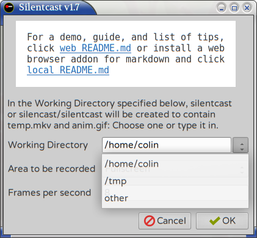

A directory named `silentcast` will be created if it doesn't already exist, and that's where temp.mkv and anim.gif will go, but where should `silentcast` go? (If you are already running another instance of Silentcast, it will create `silentcast/silentcast` if it doesn't already exist.)

- `/home/you` (your home directory) is the default choice

- `/tmp` or `/dev/shm` (your [RAM disk](http://en.wikipedia.org/wiki/Tmpfs)) After images are generated, you may want to free some memory to allow the creation of anim.gif to happen:
	- Move temp.mkv out of memory and onto your hard drive to save it (or delete it otherwise)
	- Stop the thumbnailer that's been working overtime keeping up with all the images (in Xfce the thumbnailer is tumblerd)
	- Use htop to find out what else is taking up too much memory that you can stop

- `other` (you need to type in an existing directory here)

#### Set Area

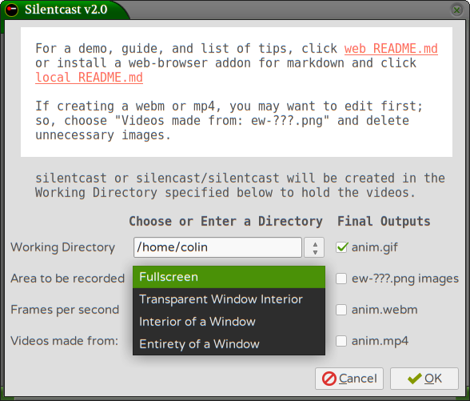

- Fullscreen
    - Records the entire screen. Dialogue 1 will be next because dialogues 3 and 2 aren't needed.
- Transparent Window Interior
    - Records the area defined by a transparent window. The next dialogue will be 3 and it will popup along with a transparent window which you can use to outline the area of the screen you want to record. The transparent window will automatically close before recording begins.
- Interior of a Window
    - Records the interior of the "next active window" which is the window that will become active after closing dialogue 2. The interior may include a menu bar or other UI elements, but does not include the title-bar or borders.
- Entirety of a Window
    - Records the "next active window" which is the window that will become active after closing dialogue 2. The entire window will be recorded, including the title-bar and borders.

#### Set Frames per second

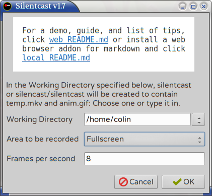

The default *Frames per second* is 8 which plays back at a reasonable speed and smoothness in gif animations served from a website. Higher frame rates will be smoother but will require a lot of memory to create. Beyond a certain rate, and playback may be too slow. Seems to work reasonably well up to 50 Frames per second though.

#### 3 Auto Resize

If you didn't Choose Fullscreen on the opening dialogue, you'll get a countdown of dialogues starting with 3. This dialogue will look and behave differently depending on whether or not you chose Transparent Window Interior.

##### No Transparent Window

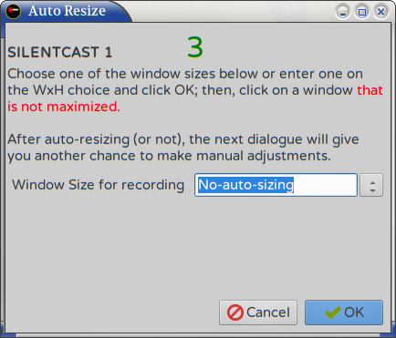

This one explains that after choosing a size, you will have to choose what window to resize by clicking on it. The mouse pointer will change to a + shape until you click a window. Nothing will happen if you click a maximized window, so you should unmaximize the window you want to record before clicking OK on this dialogue, unless you want it maximized.

##### Transparent Window

Since Silentcast put the transparent window up, it knows what you are resizing so that there's no need to click on any windows. As soon as you choose a size and click OK, it will resize the transparent window.

##### WxH

You can also enter your own size. The WxH choice is there to remind you that the first number is the width and the second number is the height and there should be an **x** between those numbers with no spaces. You can actually enter the new size on any line though.

#### 2 Manual Resize and Position

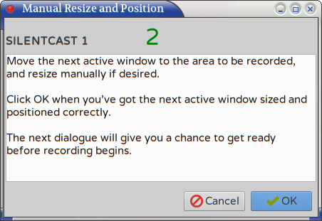

When automatically resizing, the previous dialogue moved the window to the top left corner. This dialogue gives you a chance to move and further resize the window.

If you are using a transparent window, this is the time to define the exact areay to be recorded. After clicking OK, the transparent window will close, but the area for recording will be set to where the interior of that window was.

#### 1 Get Ready

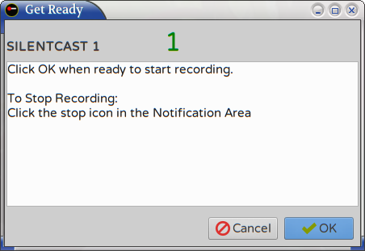

Just one last chance to get yourself and the screen ready for recording which will begin as soon as you click OK.

#### Record

There's no dialogue, but during recording there will be a stop icon in the system tray notification area. That icon will will indicate if it is the 1st or 2nd instance of Silentcast running:  

#### Stop

When you click the stop icon in the system tray notification area, you'll see a progress dialogue and your file browser open to the silentcast folder as it makes images from the recording, then the Prepare Images dialogue will popup:

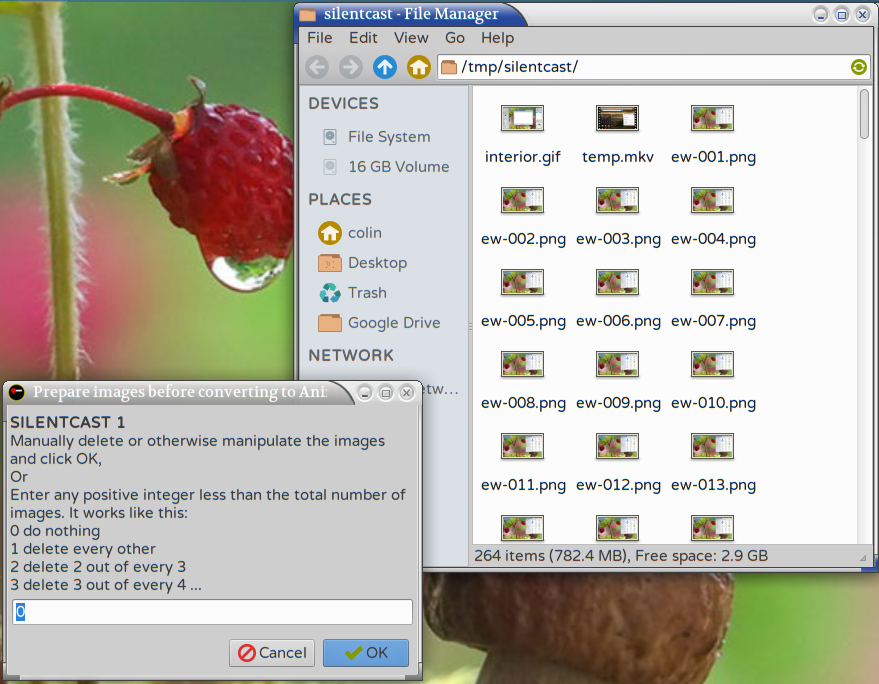

If you choose to automatically delete a lot of images to create a smaller anim.gif or because your system can't handle so many images at once, then as the dialogue explains, entering *1* will delete every other image, *2* will delete 2 out of every 3 images, etc. *Convert* will adjust timing so playback of anim.gif won't move too fast.

In addition to automatically deleting images, you may choose to "edit" the yet to be made anim.gif by selectively deleting images. Just view an image in any viewer and move forward through them to see frame by frame what anim.gif will look like. Then, if you notice for example that your mouse cursor makes a slow pointless circle, just delete those images. For more ideas on what can be done while this dialogue is up, see *List of Tips* below.

#### Convert

After preparing images and clicking OK, you'll see a progress dialogue as *convert* works on making anim.gif. If successful, Screencast has finished it's job.

However, if you don't have a large enough swap (or no swap as with my own system) and run out of memory, *convert* may crash, and you'll see this dialogue popup:

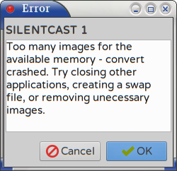

After clicking OK, you'll be back at the Prepare Images dialogue so that you can delete uneeded images or make other changes that will allow *convert* to complete anim.gif.

##List of Tips

In a future release, after I've used Silentcast for a while, I'll have a list of tips here. I'm thinking of command line stuff to for example insert an animated gif of you drawing on one of the images in the animated gif you're working on so that you can circle or highlight something in the animation. However, I haven't tried it yet and want to release this version 1.0 now.
