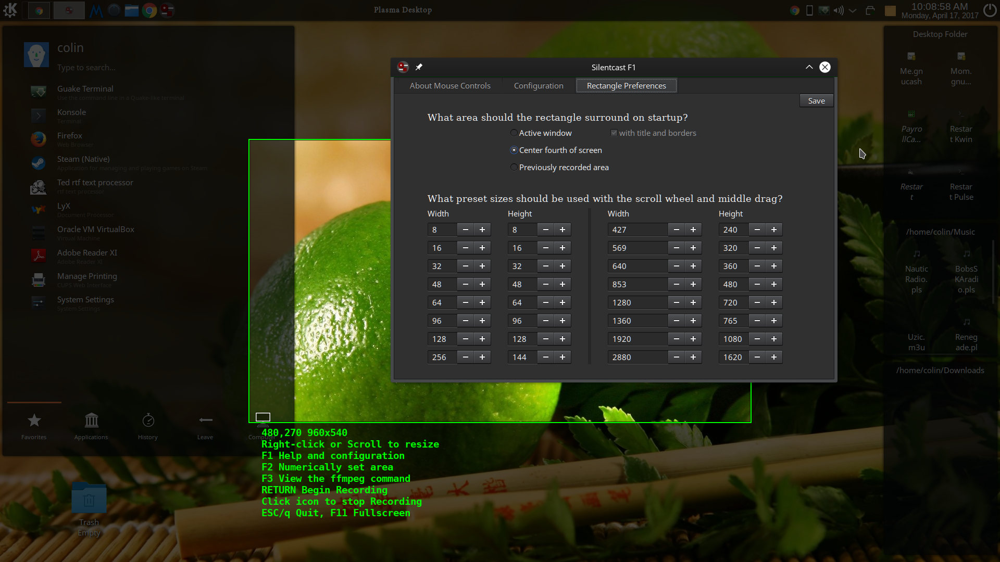

Silentcast
==========

This is not a full README (yet) for v3.0 which has a completely different GUI than previous versions. 
It's more intuitive than previous versions and explains itself well enough.
*It does not support running multiple copies of itself*, however, and so cannot record itself the way that 
the previous version did: bad things will happen if you try to run Silentcast v3.0 while it is already running.
If you make the mistake of trying to run Silentcast v3.0 while it is already running, make sure you run

    pkill -f ffmpeg

when it closes (crashes) so that `silentcast/temp.mkv.` doesn't take over your hard drive. Due to a bug that
shows on some systems where silencast is unable to kill the ffmpeg process it spawned directly, v3.02 is currently
also killing all instances of ffmpeg so that it's not possible to get a full recording of silentcast in action 
using ffmpeg either.
This problem will be fixed in a future release, but other bugs will probably be fixed first because not many 
people need to record Silentcast in action.

When ran, you will instantly get a green rectangle surrounding the active window. If that's what you wanted to
record, just press Return to start and then click the minimized Silentcast icon to stop. Here is a screenshot
showing the F1->Rectangle Preferences dialog and green rectangle. 



#### Dependencies
- gtk3
- ffmpeg
- imagemagick

#### Manual Installation

##### 1. Install Dependencies

```shell
sudo apt install libgtk-3-dev ffmpeg imagemagick
```

##### 2. Download Silentcast

[Download Latest Release of Silentcast from github.com](https://github.com/colinkeenan/silentcast/releases/latest)

##### 3. Build And Install

Navigate to where you extracted the downloaded archive and run the following commands:

```shell
make
sudo ./install
```

You should then find silentcast in your launcher. You can uninstall it with `sudo ./uninstall` in the same directory.

#### Tiling Window Managers

Starting with v3.05, it is possible to use Silentcast in Tiling Window Managers that can't iconify a window and don't show any windows behind a maximaized window. To make it work, you will have to define 3 new keybindings. The first will make Silentcast a floating window that fills the display. The second will "iconify" Silentcast by putting it on an empty workspace (named Silentcast if possible) and putting it back to fullscreen instead of floating (this will trigger Silentcast to begin recording). The third will "deiconify" Silentcast by putting back on the original workspace as a floating window that fills the display. This has only been tested in i3wm. I will provide keybindings for other tiling window managers if an issue is opened for it. The following keybindings should be added to `~/.config/i3/config`:


    # Silentcast Workaround (because i3wm can't iconify)
    #
    # After copy and pasting this, make sure to change the display size at the end
    # of the first definition ($enable_floating_fullscreen) to match your display size
    #
    # Use these keybindings as follows:
    #   1. Start Silentcast
    #   2. $mod+Shift+s to make Silentcast a floating window filling the display 
    #      (which allows other windows to be seen below it)
    #   3. Select the region to be recorded using standard Silentcast controls
    #   4. $mod+z to "iconify" silentcast to start recording (actually putting it on a
    #      workspace named Silencast and making it fullscreen again instead of floating)
    #   5. When done recording, $mod+x to "deiconify" Silentcast which will stop
    #      recording and move on to the next step as usual.
    #   

    # define what fullscreen means for floating window - have to manually set the display size
    set $enable_floating_fullscreen  border none,fullscreen disable,floating enable,move absolute position 0 0,resize set 1920 1080

    # more definitions (i3wm doesn't seem to support using $variables in definitions of other $variables)
    set $work_in_temp move container to workspace Silentcast,workspace Silentcast

    set $return_from_temp move container to workspace back_and_forth,workspace back_and_forth

    set $iconify move container to workspace Silentcast,workspace Silentcast,floating disable,fullscreen enable,workspace back_and_forth

    set $deiconify workspace Silentcast,border none,fullscreen disable,floating enable,move absolute position 0 0,resize set 1920 1080,move container to workspace back_and_forth,workspace back_and_forth

    # change from fullscreen to floating_fullscreen because iw3m won't show other windows under it otherwise
    bindsym $mod+Shift+s [class="Silentcast"] $work_in_temp,$enable_floating_fullscreen,$return_from_temp

    # "iconify"
    bindsym $mod+z [class="Silentcast"] $iconify

    # "deiconify" to stop ffmpeg and continue
    bindsym $mod+x [class="Silentcast"] $deiconify

    #
    # End of Silentcast Workaround
    #

#### KDE Plasma 5 - How to stop recording using the keyboard
Plasma 5 previews minimized windows when the mouse is over the icon which is a problem when you're trying to stop a Silentcast recording. To stop Silentcast in Plasma 5 without having to click the minimized icon, define the following keyboard shortcut: `System Settings -> (Workspace) Shortcuts -> Global Shortcuts -> KWin -> Setup Window Shortcut -> Global -> Custom` and put whatever keys are available for that. I set it to `Meta+Space`.

For example, if `Setup Window Shortcut` is set to `Meta+Space`, and you want to stop the recording with `Alt+A`, then here are the steps to stopping a Silentcast recording without using the mouse:

1. Start Silentcast
2. `Meta+Space`
3. Click in the "Press shortcut" field in the dialog that pops up in the top left corner
4. `Alt+A`
4. Click on the "OK" button in that dialog
5. Select the area to be recorded and press `Return` on your keyboard to start the recording
6. `Alt+A` to stop the recording
7. `Ctrl+Alt+A` to Activate Window Demanding Attention (which is the `Silentcast Edit Pngs` dialog at this point)
8. . . .

Something similar can probably be done on other desktops. I will look into it if an issue is raised.

#### Testing Install Scripts

You can also test the install scripts by passing an arbitrary destination directory (that doesn't need to exist already).

As an example, see the following output where we install to `test` with `./install test`, use `tree` to see what it did, and then uninstall from `test`.

```shell
$ ./install test
$ tree test
test
├── etc
│   ├── silentcast.conf
│   └── silentcast_presets
└── usr
    ├── bin
    │   └── silentcast
    └── share
        ├── applications
        │   └── silentcast.desktop
        ├── doc
        │   └── silentcast
        │       └── README.md
        ├── icons
        │   └── hicolor
        │       ├── 128x128
        │       │   └── apps
        │       │       └── silentcast.png
        │       ├── 24x24
        │       │   └── apps
        │       │       └── silentcast.png
        │       ├── 256x256
        │       │   └── apps
        │       │       └── silentcast.png
        │       ├── 32x32
        │       │   └── apps
        │       │       └── silentcast.png
        │       ├── 48x48
        │       │   └── apps
        │       │       └── silentcast.png
        │       └── 64x64
        │           └── apps
        │               └── silentcast.png
        └── licenses
            └── COPYING

22 directories, 12 files
$./uninstall test
$tree test
test
├── etc
└── usr
    ├── bin
    └── share
        ├── applications
        ├── doc
        ├── icons
        │   └── hicolor
        │       ├── 128x128
        │       │   └── apps
        │       ├── 24x24
        │       │   └── apps
        │       ├── 256x256
        │       │   └── apps
        │       ├── 32x32
        │       │   └── apps
        │       ├── 48x48
        │       │   └── apps
        │       └── 64x64
        │           └── apps
        └── licenses

21 directories, 0 files
```

Notice that `./uninstall test` deleted all the files, but only deleted the one subdirectory named `silentcast`. Don't forget to specify `test` when uninstalling, and don't use `sudo` when not doing a system-wide install or uninstall.
